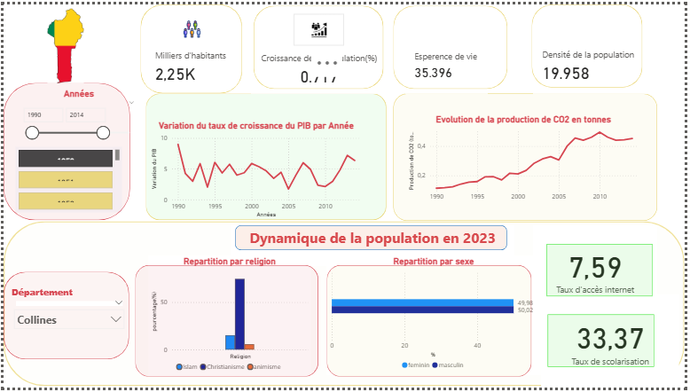

  

## À propos du projet
Dans le cadre du **Challenge ANIP – Visualisation de Données**, j’ai participé en tant que **candidat** pour collecter, analyser et valoriser les données démographiques, économiques, sociales et sportives du Bénin.  

L’objectif était de créer un **tableau de bord interactif Power BI** permettant de révéler des tendances cachées, détecter des anomalies et produire des insights exploitables pour orienter les politiques publiques et les événements sportifs et sociaux.

---

## Mon rôle et réalisations
En tant que participant, j’ai réalisé les principales tâches suivantes :

### 1. Collecte et préparation des données
- Identification et collecte de **sources ouvertes fiables** (WorldPop, UN, DHS, IMF, OECD, WHO, etc.)  
- Nettoyage et harmonisation des données issues de multiples sources  
- Création d’un **dataset consolidé** prêt à l’analyse  

### 2. Exploration et analyse
- Analyse exploratoire pour mettre en évidence **tendances historiques et dynamiques spatiales**  
- Détection et documentation des anomalies et incohérences  
- Création de **variables dérivées** et indicateurs pertinents (taux de croissance, ratios, indices composites)  
- Agrégation des données par région, département et commune  

### 3. Visualisation et storytelling
- Conception d’un **dashboard Power BI interactif** multi-thématique  
- Ajout de filtres dynamiques et segments visuels pour faciliter l’exploration des données  
- Mise en avant d’**indicateurs clés** et de **trends actionnables**  
- Narration visuelle claire pour raconter l’histoire des données et aider à la prise de décision  

---

## Livrables
- Dataset final nettoyé et enrichi (CSV/Excel)  
- Notebook Python détaillant la collecte, le nettoyage et la préparation des données  
- Glossaire/dictionnaire des variables utilisées  
- Fichier Power BI (.pbix) complet avec toutes les visualisations  
- Captures et exportations du dashboard Power BI  
- Rapport synthèse présentant les insights clés et recommandations  

---

## Compétences mises en œuvre
- **Data Science & Machine Learning** : nettoyage, préparation, exploration et création d’indicateurs  
- **Power BI** : visualisation, dashboard interactif et data storytelling  
- **Gestion de projet de données** : collecte multi-sources, harmonisation et documentation  

---

## Citation
ANIP Bénin. ANIP - Challenge 1 – Visualisation de Données. [Kaggle](https://kaggle.com/competitions/anip-challenge-1-visualisation-de-donnees), 2025.

---

## Participation
- **Rôle :** Participant  
- **Nombre d’entrants :** 222  
- **Kudos obtenus :** Oui
